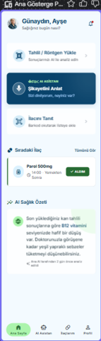
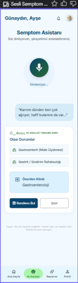
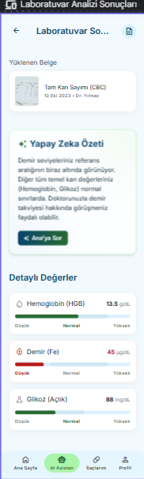
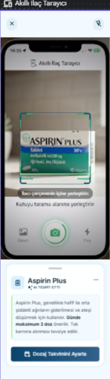
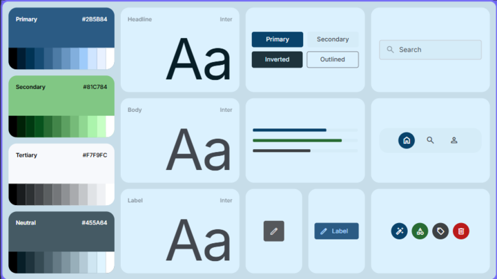
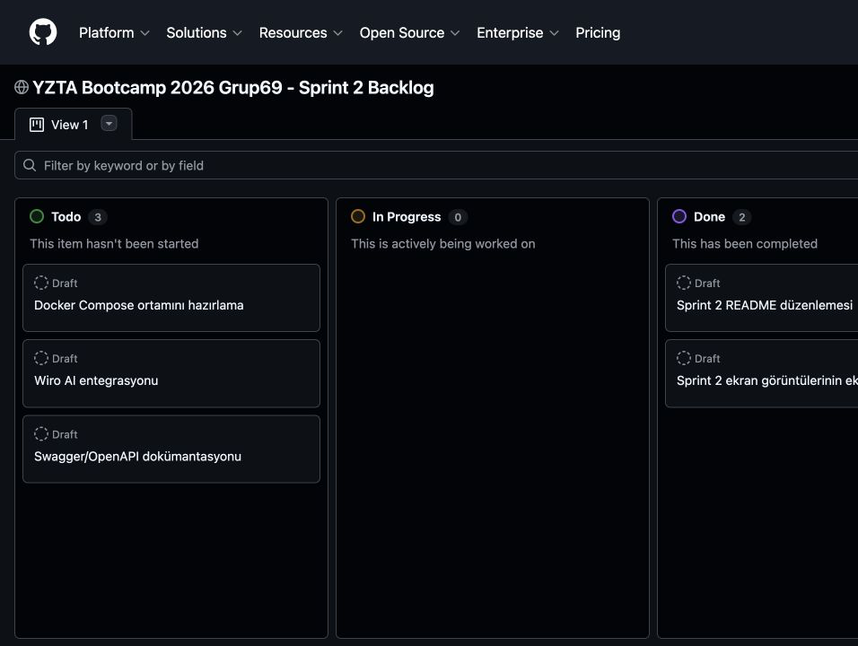
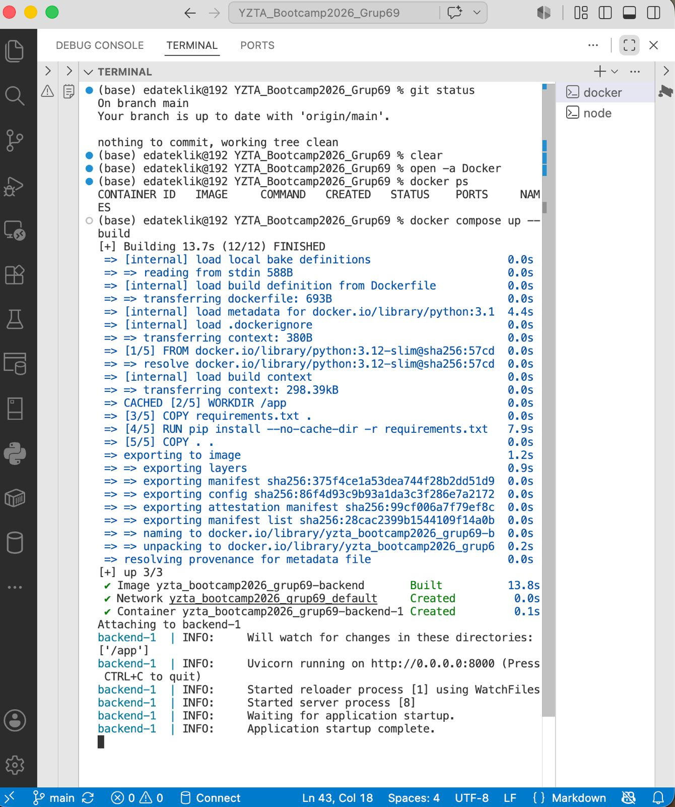
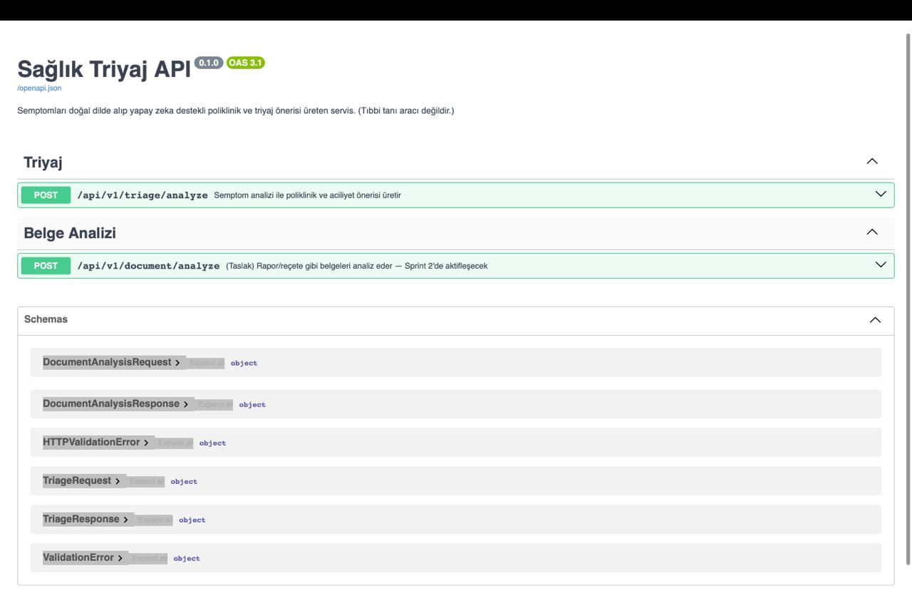
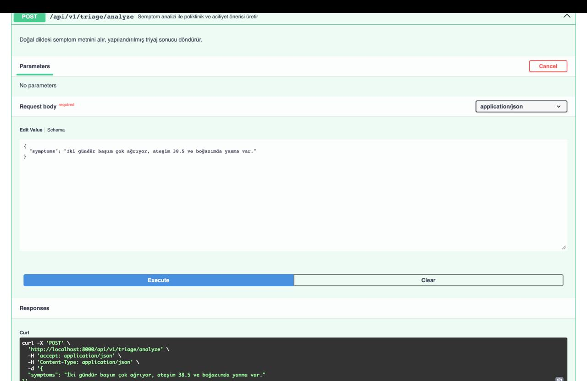
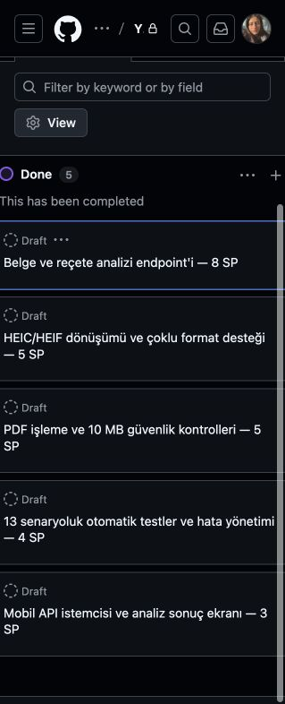

# YZTA Bootcamp 2026 - Grup 69

## Takım İsmi
**Grup 69**

## Ürün ile İlgili Bilgiler

### Takım Üyeleri

| İsim | Rol |
|---|---|
| Emine İclal Oğuz | Product Owner / Developer |
| Eda Nur Teklik | Scrum Master / Developer |
| Ahsen Nur ALDAŞ | Developer |
| Batuhan Tombaş | Developer |
| Emre Kaan ÖZKAN | Developer |

### Ürün İsmi
**Ana Odak**

### Ürün Açıklaması
Ana Odak, kullanıcıların sağlıkla ilgili belirsizliklerini azaltmayı ve doğru sağlık birimine daha bilinçli şekilde yönelmelerini sağlamayı amaçlayan yapay zekâ destekli bir mobil sağlık asistanıdır. Kullanıcının yazılı veya sesli olarak ilettiği belirtileri analiz ederek uygun poliklinik ve aciliyet seviyesi hakkında açıklamalı yönlendirme sunar.

Uygulama ayrıca kamera, galeri veya dosya yükleme yoluyla paylaşılan tahlil, reçete ve ilaç kutusu görsellerini inceleyerek anlaşılır bir özet, önemli bulgular ve danışılabilecek ilgili sağlık bölümünü belirtir. Ana Odak tanı koymaz, ilaç veya doz önermez ve sağlık uzmanının yerini almaz; kullanıcıyı doğru zamanda uygun sağlık hizmetine yönlendirmeyi amaçlar.

### Ürün Özellikleri
- Yapay zeka destekli semptom analizi
- Sesli ve yazılı semptom girişi
- Poliklinik önerisi
- Aciliyet seviyesi belirleme
- Laboratuvar analizi (Sprint 2)
- Akıllı ilaç tarayıcı (Sprint 2)

### Hedef Kitle

- Yaşadığı semptomlara göre hangi polikliniğe başvuracağını bilmeyen kullanıcılar
- Sağlık şikayetlerini ön değerlendirmeden geçirmek isteyen kişiler
- Laboratuvar sonuçlarını daha anlaşılır görmek isteyen kullanıcılar
- Mobil sağlık asistanı deneyimi arayan kullanıcılar

---

## 📱 Mobil Uygulama (React Native / Expo)

`mobile/` klasörü içerisinde React Native (Expo SDK 54) ve TypeScript ile geliştirilmiş **Ana Odak Mobil Uygulaması** yer almaktadır.

🔗 **Bağımsız mobil uygulama kaynak deposu:** [philisterbt/Ana-Odak](https://github.com/philisterbt/Ana-Odak)

Mobil uygulamanın bağımsız geliştirme deposundaki kaynaklar ana projeye `mobile/` klasörü altında entegre edilmiştir. Backend ile birlikte çalıştırılacak güncel bütünleşik sürüm bu repository içindeki `mobile/` klasörüdür.

### Mobil Uygulama Özellikleri & Ekran Yapısı
- **Ana Sayfa (Home):** Kişiselleştirilmiş sağlık özet paneli, hızlı işlem kartları (Tahlil Yükle, Semptom Anlat, İlaç Tanıt) ve ilaç saatleri takibi.
- **Semptom Asistanı (AI Triyaj):** Metin ve sesli girdi desteği ile semptom analizi, aciliyet seviyesi değerlendirmesi ve ilgili poliklinik yönlendirmesi.
- **Laboratuvar ve Belge Analizi:** Tahlil, reçete ve tıbbi rapor yükleme arayüzü ile kritik değerlerin görsel grafiklerle gösterimi.
- **Akıllı İlaç Tarayıcı:** İlaç kutusu tarama, dozaj ve periyot önerileri.
- **Kişisel Sağlık Profili:** Kan grubu, yaş, kilo, kronik rahatsızlıklar ve alerji takip sistemi.

### Mobil Uygulama Kurulumu ve Çalıştırılması

```bash
# 1. Mobil klasörüne geçin
cd mobile

# 2. Bağımlılıkları yükleyin
npm install

# 3. Geliştirme sunucusunu başlatın
npm run start

# 4. Mobil cihazda canlı test (Expo Go):
npx expo start --tunnel
```

Detaylı mobil arayüz ve mimari dokümantasyonu için [mobile/README.md](mobile/README.md) dosyasına bakabilirsiniz.

---

## Sprint 1

### Sprint Notları

Sprint 1'de backend temel mimarisi, FastAPI altyapısı, triyaj servisi, Pydantic şemaları, temel testler ve mobil uygulama ile haberleşecek API yapısı oluşturulmuştur.

### Sprint İçinde Tamamlanması Tahmin Edilen Puan

**26 Story Point**

### Puan Tamamlama Mantığı

Görevler teknik zorluk, bağımlılık ve geliştirme süresi dikkate alınarak puanlanmıştır.

| Görev | Story Point |
|---|---:|
| Katmanlı mimari | 5 |
| Triyaj servisi | 8 |
| Belge analizi | 3 |
| Veri sözleşmeleri | 5 |
| Guardrail sistemi | 5 |

### Sprint Backlog

MoSCoW yöntemi kullanılarak önceliklendirme yapılmıştır.

- Must: Triyaj API, veri sözleşmeleri
- Should: Belge analizi taslağı
- Could: Test otomasyonu
- Won't: Docker, RAG

### Daily Scrum

Sprint boyunca günlük toplantılar gerçekleştirilmiş, görev dağılımı ve blocker'lar düzenli olarak takip edilmiştir.

### Sprint Board Update

Sprint sonunda planlanan görevlerin tamamı tamamlanmıştır.

### Ürün Durumu

Sprint 1 sonunda backend çekirdeği çalışır durumdadır.

#### Ekran Görüntüleri

<p align="center">



</p>

<p align="center">


</p>

### Sprint Review

- Katmanlı mimari sunuldu.
- Triyaj modülü gösterildi.
- API sözleşmeleri paylaşıldı.
- Sprint 2 hedefleri belirlendi.

### Sprint Retrospective

#### İyi Gidenler

- Katmanlı mimari
- Test odaklı geliştirme
- Mobil ekiple uyum

#### İyileştirilecekler

- Dokümantasyon
- İletişim
- Ortak test ortamı

#### Sprint 2 Hedefleri

- OCR
- RAG
- Laboratuvar analizi
- Docker hazırlıkları

---

## Sprint 2

### Sprint Notları

Sprint 2'de FastAPI backend'i için Docker imajı ve Docker Compose tabanlı geliştirme ortamı eklenmiştir. Compose yapılandırmasında kaynak kod bağlama ve Uvicorn hot reload desteği bulunmaktadır. Triyaj servisi, Wiro AI'ın görev tabanlı API akışına uyarlanmış; görev başlatma, sonuç için durum sorgulama (polling), model parametrelerini keşfetme ve dönen JSON yanıtını `TriageResponse` şemasıyla doğrulama kodlanmıştır. Kullanılacak model ve sağlayıcı adresi ortam değişkenleri üzerinden yapılandırılabilmektedir.

Belge/laboratuvar analizi halen taslak bir yer tutucu yanıt döndürmektedir. İlaç tarayıcı, gelişmiş RAG hattı ve bağımsız bir asenkron görev kuyruğu implementasyonu repository içinde bulunmamaktadır.

### Sprint İçinde Tamamlanması Tahmin Edilen Puan

**30 Story Point**

### Puan Tamamlama Mantığı

Görevler mimari entegrasyon, üçüncü taraf API adaptörü, konteynerizasyon ve model yapılandırması dikkate alınarak puanlanmıştır. Aşağıdaki durumlar repository kodu ve commit geçmişine göre belirtilmiştir; tahmini puanlar tamamlanan puan beyanı değildir.

| Planlanan görev | Story Point | Doğrulanan durum |
|---|---:|---|
| Docker konteynerizasyonu ve hot reload | 5 | Kod ve yapılandırma mevcut |
| Wiro AI entegrasyonu ve adaptör katmanı | 8 | Kod mevcut |
| Wiro tabanlı triyaj akışı ve yanıt doğrulama | 8 | Kod mevcut; canlı servis sonucu repository üzerinden doğrulanmadı |
| Sağlayıcı görevlerini polling ile takip etme ve model yönetimi | 5 | Kod mevcut |
| API dokümantasyonu ve test süreçleri | 4 | FastAPI/OpenAPI açıklamaları mevcut; test dosyası bulunmuyor |

### Daily Scrum

Sprint 2 README notlarında günlük toplantılar yapıldığı belirtilmiştir. Repository içinde Daily Scrum kayıtları veya toplantı notları bulunmadığından ayrıntılar kod üzerinden doğrulanamamaktadır.

### Sprint Backlog

MoSCoW yöntemiyle belgelenen öncelikler:

- **Must:** Docker altyapısı, Wiro AI adaptörü ve triyaj API entegrasyonu
- **Should:** Sağlayıcı görevlerini polling ile takip etme ve ortam değişkenleri üzerinden model seçimi
- **Could:** Mobil yükleme deneyimi için optimizasyon çalışmaları
- **Won't:** Gelişmiş RAG hattı bu sprint kapsamında uygulanmadı

🔗 [Sprint 2 Backlog Panosuna Git](https://github.com/users/edateklik/projects/1)

### Sprint Board Update

README güncellemesi sırasında herkese açık Sprint 2 panosunda **3 Todo**, **0 In Progress** ve **2 Done** kartı görünmektedir. Güncel durumu yukarıdaki pano bağlantısından takip edebilirsiniz.

#### Sprint Board Ekran Görüntüsü

Sprint board ekran görüntüsü, görevlerin **Todo**, **In Progress** ve **Done** sütunlarındaki sprint sonu dağılımını göstermektedir.

<p align="center">
  <a href="https://github.com/users/edateklik/projects/1">
    
  </a>
</p>

### Ürün Durumu

Backend için Docker ve Docker Compose dosyaları mevcuttur. `/api/v1/triage/analyze` uç noktası, gerekli sağlayıcı yapılandırması sağlandığında Wiro AI görevini başlatacak, sonucu polling ile takip edecek ve yapılandırılmış triyaj yanıtını doğrulayacak şekilde uygulanmıştır. Harici servisle canlı çalışma ve model maliyet/kalite sonuçları repository içindeki dosyalardan doğrulanamamaktadır.

Belge analizi uç noktası halen `draft_placeholder` durumunda sabit yanıt döndürmektedir; laboratuvar analizi, OCR ve ilaç tarayıcı tamamlanmış değildir.

### Ekran Görüntüleri

<p align="center">
  
  
</p>

<p align="center">
  
</p>

### Sprint Review

- Dockerfile ve hot reload destekli Docker Compose geliştirme yapılandırması eklendi.
- Wiro AI için görev başlatma ve sonuç polling adaptörü eklendi.
- Model parametrelerinin sağlayıcıdan keşfedilmesi ve desteklenmeyen sistem alanları için prompt yedeği eklendi.
- Model seçimi ve sağlayıcı adresi ortam değişkenleriyle yapılandırılabilir hale getirildi.
- Triyaj çıktısının JSON olarak ayrıştırılması ve Pydantic şemasıyla doğrulanması sürdürüldü.

### Sprint Retrospective

#### İyi Gidenler

- Docker tabanlı yerel geliştirme yapısı repository'ye eklendi.
- Sağlayıcıya özgü görev akışı ayrı bir servis katmanında toplandı.
- Model parametrelerinin çalışma zamanında keşfedilmesiyle farklı model yapılarına uyum sağlandı.
- Sağlayıcı ve çıktı hataları API katmanında açıklayıcı HTTP hata yanıtlarına dönüştürüldü.

#### İyileştirilecekler

- Wiro AI entegrasyonu için otomatik testler eklenmeli.
- Polling süreleri ve hata senaryoları ölçülerek mobil kullanıcı deneyimi iyileştirilmeli.
- Model maliyet/kalite dengesi canlı test sonuçlarıyla belgelenmeli.
- Taslak belge analizi açıklamaları mevcut ürün durumuyla uyumlu hale getirilmeli.

### Sprint 3 Hedefleri

- Wiro AI adaptörü ve triyaj akışı için otomatik testler eklemek
- Model maliyet, kalite ve yanıt süresi ölçümlerini belgelemek
- Mobil tarafta uzun süren sağlayıcı görevleri için yükleme ve hata deneyimini iyileştirmek
- Belge/laboratuvar analizi ve OCR kapsamını netleştirip gerçek implementasyonu planlamak
- Sprint backlog bağlantısını ve Sprint 2 ürün ekran görüntülerini dokümantasyona eklemek


## Sprint 3

### Sprint Notları

Sprint 3'te tıbbi belge ve reçete analizi backend'e entegre edilmiştir. JPEG, PNG, HEIC ve HEIF görselleri için dosya doğrulama altyapısı hazırlanmış; HEIC/HEIF görsellerinin JPEG'e otomatik dönüştürülmesi sağlanmıştır. Metin katmanlı PDF desteği, 10 MB dosya sınırı, çözünürlük kontrolleri ve mobil istemciyle uyumlu multipart yükleme sözleşmesi uygulanmıştır. Mobil uygulamaya belge analiz API istemcisi, yükleme göstergesi ve yapılandırılmış analiz sonuç ekranı eklenmiştir.

### Sprint İçinde Tamamlanması Tahmin Edilen Puan

**25 Story Point**

### Puan Tamamlama Mantığı

Görevler çoklu format desteği, otomatik görsel dönüştürme, güvenlik validasyonları, hata yönetimi ve mobil entegrasyon gereksinimleri dikkate alınarak puanlanmıştır.

| Görev | Story Point |
| --- | --- |
| Belge ve reçete analizi endpoint geliştirme (`POST /api/v1/document/analyze`) | 8 |
| HEIC/HEIF otomatik JPEG dönüşüm ve çoklu format desteği | 5 |
| PDF metin katmanı işleme ve 10 MB dosya/güvenlik sınırları | 5 |
| Otomatik test senaryoları (13 senaryo) ve hata yönetimi | 4 |
| Mobil API istemcisi, yükleme durumu ve analiz sonuç ekranı | 3 |

### Sprint Backlog

MoSCoW yöntemi kullanılarak önceliklendirme yapılmıştır.

* **Must:** Belge analiz endpoint'i, HEIC/JPEG dönüşüm altyapısı, 10 MB boyut ve güvenlik validasyonları
* **Should:** Metin katmanlı PDF desteği, 13 senaryoluk otomatik test dosyası ve mobil API istemcisi
* **Could:** Gerçek kamera/galeri/dosya seçici, açık timeout/iptal yönetimi ve gelişmiş analiz durumu bildirimleri
* **Won't:** Optik Karakter Tanıma (OCR) için yerel model yedekleme (Sonraki sprintlere ertelendi)

🔗 [Sprint 3 Backlog Panosuna Git](https://github.com/users/edateklik/projects/3)

### Daily Scrum

Sprint boyunca gerçekleştirilen Daily Scrum toplantılarında HEIC/HEIF uyumluluğu, belge güvenliği, Wiro AI entegrasyonu, mobil yükleme sözleşmesi ve test sonuçları değerlendirilmiştir. Görevlerin ilerleme durumu ve karşılaşılan teknik konular düzenli olarak takip edilmiştir.

### Sprint Board Update

Sprint 3 kapsamında planlanan **25 Story Point** değerindeki beş ana görev GitHub Projects panosunda tamamlanmış olarak güncellenmiştir.

#### Sprint Board Ekran Görüntüsü

Aşağıdaki gerçek GitHub Projects ekran görüntüsünde Sprint 3 için tamamlanan beş görev **Done** sütununda görülmektedir.

<p align="center">
  <a href="https://github.com/users/edateklik/projects/3">
    
  </a>
</p>

### Ürün Durumu

Sprint 3 sonunda backend sistemi; tıbbi belge ve reçeteleri analiz edebilir, iPhone cihazlardan gelen HEIC/HEIF görsellerini JPEG'e çevirebilir, metin katmanlı PDF dosyalarını işleyebilir ve bozuk, aşırı çözünürlüklü veya 10 MB sınırını aşan dosyaları AI çağrısından önce reddedebilir duruma gelmiştir.

Mobil uygulamaya belge analiz API'sine multipart istek gönderen istemci entegre edilmiştir. Yükleme göstergesi, hata durumu ve yapılandırılmış analiz sonuçlarını sunan ekran hazırlanmış; mobil ve backend veri sözleşmeleri uyumlu hale getirilmiştir.

### Ekran Görüntüleri

<p align="center">
  
  
</p>

### Sprint Review

* `POST /api/v1/document/analyze` endpoint'i ve analiz yetenekleri tanıtıldı.
* HEIC/HEIF formatlarının otomatik JPEG dönüşüm mekanizması gösterildi.
* 10 MB dosya sınırı ve erken aşama güvenlik/bozuk dosya reddetme mantığı paylaşıldı.
* 13 senaryoluk otomatik test dosyası, mobil API istemcisi, yükleme göstergesi ve analiz sonuç ekranı aktarıldı.

### Sprint Retrospective

#### İyi Gidenler

* HEIC/HEIF formatlarının sunucu tarafında otomatik JPEG'e çevrilmesiyle mobil uyumluluk riskinin azaltılması
* Bozuk veya aşırı çözünürlüklü dosyaların AI servislerine gönderilmeden erken aşamada reddedilerek kaynak tasarrufu sağlanması
* 13 senaryoluk kapsamlı otomatik test dosyası sayesinde canlı kontrollerin hızlanması

#### İyileştirilecekler

* Wiro AI analiz sürelerinin ölçülmesi; mobil istemciye açık timeout, iptal ve yeniden deneme davranışlarının eklenmesi
* Örnek dosya URI'si yerine gerçek kamera/galeri/dosya seçici entegrasyonunun tamamlanması
* Büyük boyutlu PDF ve görsel yüklemelerinde bellek (RAM) tüketiminin izlenmesi ve optimize edilmesi
