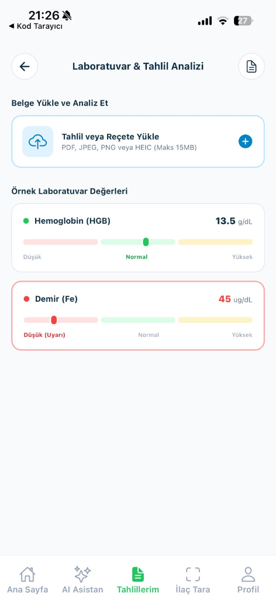
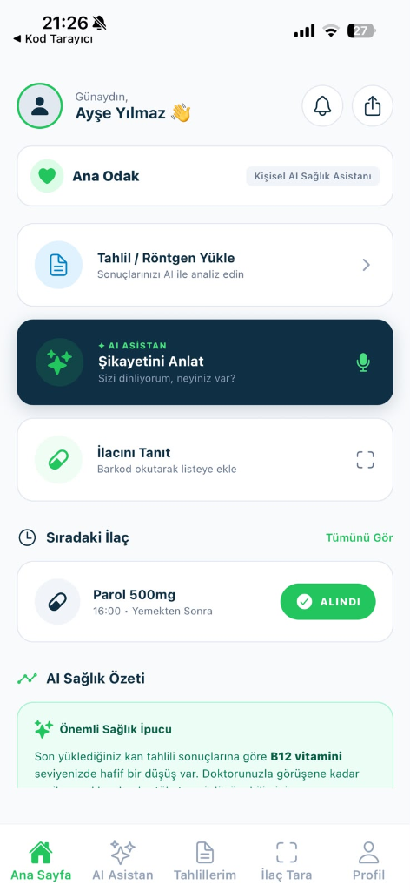

# Ana Odak - Kişisel AI Sağlık Asistanı Mobil Uygulaması

Ana Odak, kullanıcıların semptomlarını doğal dilde ileterek AI triyaj analizi yapabildiği, tahlil ve tıbbi belgelerini yükleyip yapay zeka ile özetleyebildiği ve ilaç takibini gerçekleştirebildiği modern bir React Native (Expo SDK 54) mobil uygulamasıdır.

## Uygulama Ekran Görüntüleri

<p align="center">
  
  
  
</p>

## Öne Çıkan Özellikler

### 1. Ana Sayfa (Home Screen)
- Kullanıcı karşılama ve kişiselleştirilmiş sağlık özet paneli.
- Tahlil yükleme, semptom anlatma ve ilaç tanıtma hızlı erişim kartları.
- İlaç saatleri ve alım durumu takip sistemi.
- Yapay zeka tarafından üretilen kişisel sağlık ipuçları.

### 2. Semptom Asistanı ve AI Triyajı
- Doğal dilde yazılı veya sesli olarak iletilen şikayetlerin analizi.
- Semptomların aciliyet seviyesinin (Kırmızı, Sarı, Yeşil) otomatik değerlendirilmesi.
- Şikayete uygun tıbbi poliklinik yönlendirmesi ve gerekçe açıklaması.
- Acil durumlar için özel uyarı sistemleri.

### 3. Laboratuvar ve Belge Analizi
- Tahlil, reçete ve tıbbi rapor yükleme arayüzü.
- Belgedeki kritik değerlerin yapay zeka tarafından okunup özetlenmesi.
- Parametrelerin referans aralığına göre görsel grafiklerle gösterimi (Normal, Düşük, Yüksek).

### 4. Akıllı İlaç Tarayıcı
- İlaç kutusu tarama ve tanıma arayüzü.
- İlaç kullanım dozu ve periyot önerileri.

### 5. Kişisel Sağlık Profili
- Kan grubu, yaş, kilo ve boy gibi temel sağlık verilerinin takibi.
- Düzenli kullanılan ilaçlar, alerjiler ve kronik rahatsızlık ayarları.

## Teknolojik Mimari ve Bağımlılıklar

- Framework: React Native (Expo SDK 54)
- Yönlendirme: Expo Router (Dosya tabanlı navigasyon)
- Dil: TypeScript
- UI Bileşenleri: React Native Components, Expo Vector Icons
- Tasarım Sistemi: HSL tailored renk paleti, custom card layoutlar, responsive UI
- Güvenli Alan Yönetimi: react-native-safe-area-context
- Ağ ve API Entegrasyonu: Custom API Client, fallback mock data desteği

## Kurulum ve Çalıştırma

### 1. Bağımlılıkların Yüklenmesi
```bash
npm install
```

### 2. Geliştirme Sunucusunun Başlatılması
```bash
npm run start
```

### 3. Tünel (Tunnel) Modunda Çalıştırma (Mobil Cihazlar İçin)
```bash
npx expo start --tunnel
```

### 4. Platform Komutları
- Web üzerinde çalıştırma: `npm run web`
- Android emülatörde çalıştırma: `npm run android`
- iOS simülatörde çalıştırma: `npm run ios`

## Proje Klasör Yapısı

- app/ - Expo Router sayfa ve sekme bileşenleri
- components/ - Yeniden kullanılabilir arayüz elemanları
- constants/ - Tema renkleri ve sabitler
- services/ - Backend API entegrasyonu ve simülasyon servisleri
- docs/screenshots/ - Uygulama ekran görüntüleri
